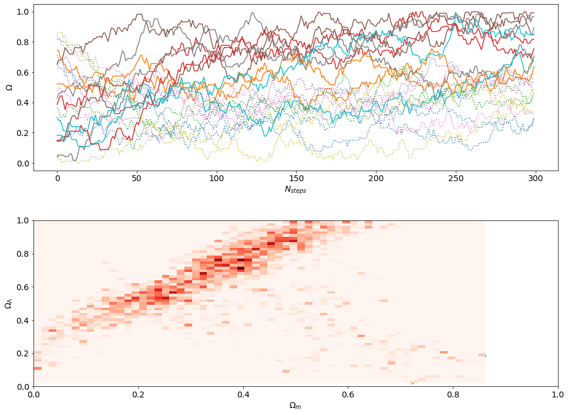

# Supernovae_MCMC

Run Monte Carlo Markov Chains using the Metropolis-Hastings algorithm with Supernovae Ia data to perform cosmological parameter inference.

Project for the [*2018 Astronomical Data Analysis ADA IX School*](http://ada.cosmostat.org/), for the [bayesian statistics tutorial by Roberto Trotta](https://github.com/ADAIX/Bayesian-Tutorial).

